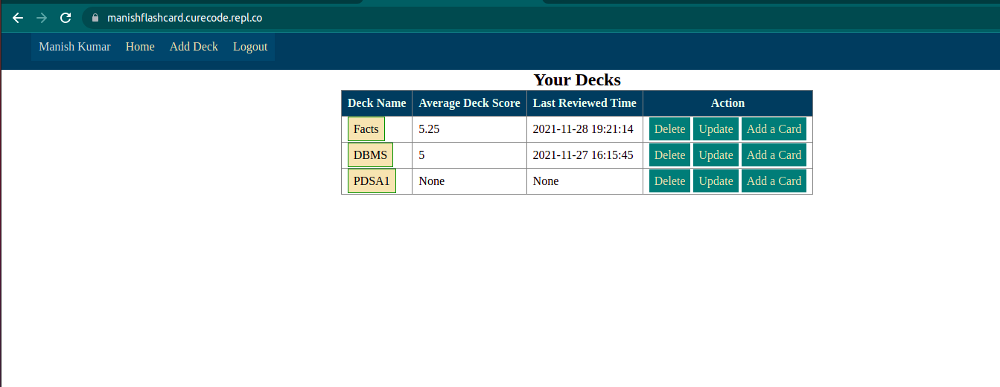
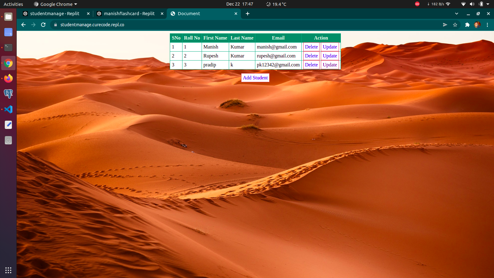

### Objective
To work in an environment which encourages me to succed and grow professionally where I can utilize my skills and knowledge appropriately.
### Languages
- Hindi
- English
- Maithili
- Bhojpuri
### Co-curricular activities
- Drama (Awarded with memento by IMS BHU)
- Youth parliament (Faculty of Law BHU)
### Hobbies
- Flute
- Teaching
- Travelling
- Drama
### Education
- Diploma in Microfinance and Entrepreneurship, IMS BHU
- BSc Physics, ISc BHU
- MSc Physics, ISc BHU
- Enterpreneurship, UPGRAD
- BSc in programming and Data Science, IITM
### Skills
- Languages : C, PHP, Python, JavaScript
- Core skills : DBMS, DSA, flask
### Learning
- Data Science
- Machine learning
- Unix
### Projects
#### Flash card
- Technology used : Python, flask, SQLite, HTML, CSS
- Live link : [Go](https://manishflashcard.curecode.repl.co/)
- Screenshot: 
#### Student Management
- Technology used : Python, flask, SQLite, HTML, CSS
- Live link : [Go](https://studentmanage.curecode.repl.co/)
- Screenshot: 
